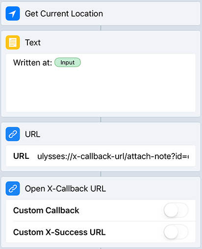
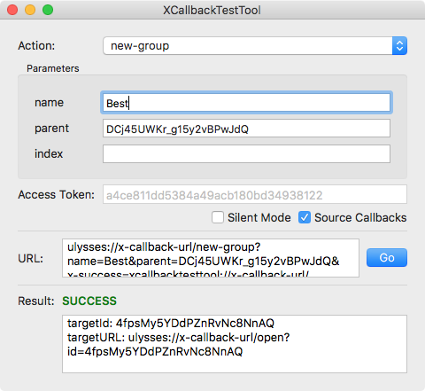
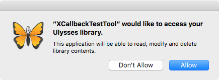

Title: Getting Started with X-Callback Actions
CSS: style.css

# Getting Started with X-Callback Actions
Ulysses can talk to other apps on Mac and iOS using a feature called *X-Callback-URL*. This allows you to send text and images from other apps to Ulysses (and vice versa), and automate repetitive tasks.

For example, let's say you want to remember where you wrote each part of your novel. When you're finished, you could see which places inspired you to write particularly well.

To do this, you could open the Maps app on iOS, copy the current address, and attach it as a note to a sheet. This would be tedious, but you can automate it using the iOS *Workflow* app. The workflow looks like this:

First, the workflow gets the current location (address) and prepends the text “Written at: ”. It then tells Ulysses to create a new note with the complete text.

This workflow can be added to your home screen or notification center, and can be run with a single tap.

## The Basics
An X-Callback-URL looks like a web address, for example:

	ulysses://x-callback-url/open-all

The first part, `ulysses://`, indicates that Ulysses is the receiving app. The `x-callback-url` part tells Ulysses that the address is an X-Callback-URL. This front part is always the same. The `open-all` indicates the action that should be performed. In this case, Ulysses will open the “All” filter. You can find a complete list of available actions in the [KB article](/kb/x-callback-url/).

A simple way to run an action is to copy and paste it into your web browser's address bar and press ⏎. You can try it right now with the address above, or by clicking [here](ulysses://x-callback-url/open-all). Ulysses should open and show the "All" filter.

## Action Parameters
Ulysses has a `new-group` action which creates a new group. For example:

	ulysses://x-callback-url/new-group?name=Ideas

Running this action will create a new group named “Ideas”. Note the `?` after the action name. Anything after it are parameters for the action. The `new-group` action has a `name` parameter, which is the name of the new group. Parameter values are passed like this: `some-parameter-name=some-value`.

You may have noticed that the new group was created inside the *top level group*. Depending on your preferences, this could be “iCloud”, “On My Mac/iPhone/iPad” or an external folder. It's easy to create a new group inside an existing parent group:

	ulysses://x-callback-url/new-group?name=Awesome&parent=Ideas

This will create a new group “Awesome” inside of the “Ideas” group we created earlier. As you can see, multiple parameters in a URL are separated by an `&`.

Parameters must be *URL encoded*, meaning that spaces and special characters need to be replaced. For example, “Pots & Pans” becomes `Pots%20%26%20Pans`. You can use [this website](http://meyerweb.com/eric/tools/dencoder/) to encode a text.

## Paths and Identifiers
In the previous section, you have created a new group inside the “Ideas” group by using the parameter `parent=Ideas`. This works fine as long as there is just one group named “Ideas” in your library. If you have more than one group with the same name, you can use a *path* to pick a specific one. A path starts with a slash character `/` and tells Ulysses where to go, starting at the top level group. For example, the path `/Ideas/Awesome` points to the “Awesome” group you've created above.

	ulysses://x-callback-url/new-group?name=Best&parent=/Ideas/Awesome

However, if you move the “Awesome” group somewhere else, the path becomes invalid. This means that any URLs that refer to it will stop working, until you change them to use the new path. This can become tedious, so a better way is to use the *identifier* of the “Awesome” group.

Every group, sheet and filter has a unique identifier. If you're using iCloud or a local library, the identifier remains the same even if you edit, rename or move the item. It's like the number on your ID card, which doesn't change when you move or change your last name. In external folders, the identifier can change if you move or rename an item. An identifier looks like this:  
`DCj45UWKr_g15y2vBPwJdQ`.

To get the identifier of an item:

- On iOS, open the sheet list or library. Swipe-left on a sheet or group in iCloud or your local library, and tap the “More” button. Select the “Share” action and tap the “Copy Identifier” activity.
- On macOS, hold ⌥ while right-clicking a sheet or group in iCloud or your local library. Select “Copy Callback Identifier” from the menu.

The identifier is copied to the clipboard. You can then paste it into a URL, like this:

	ulysses://x-callback-url/new-group?name=Best&parent=DCj45UWKr_g15y2vBPwJdQ

This URL will work regardless of how you rename the item, or where you move it.

## XCallbackTestTool
A great way to get an overview of all available actions and how to use them is our free **XCallbackTestTool** for Mac:

You can download it [here](Ulysses-XCallbackTestTool.zip "Download the XCallbackTestTool"). The upper part of the window allows you to select the action to run. You can then enter any action parameters and run the action by clicking the “Go” button. The app also shows you the URL that will be called. You can copy & paste it in a text file to run the action with the same parameters later.

If the ”Source Callbacks” option is enabled, Ulysses will pass the result of the action call back to the test tool. The bottom part of the window shows whether the action was run successfully, and any other information from Ulysses.

The “Silent Mode” switch prevents Ulysses from taking focus when running an action. If enabled, the test tool will keep focus while running actions.

When you try some actions such as “get-item”, you might see the text “errorMessage: Access denied.” in the result area. The next section explains what this means and how to solve it.

## Authorization
To protect the Ulysses library against access from malicious apps, actions that expose content or destructively change it require the calling app to be authorized. To authorize the *XCallbackTestTool*, select the “authorize” action, make sure that “Source Callbacks” is enabled, and click “Go”. Ulysses will show a dialog prompting you to allow or deny the tool access to your Ulysses library:

Click “Allow” and the test tool should report that the action was successful. In addition, the “Access Token” field now contains a code. The code must be added to the URL when calling actions such as “get-item”. To find out which actions require authorization, please check the [KB article](/kb/x-callback-url/).

Select the “get-item” action again. Note how the “Access Token” field still contains the code, and the URL now contains an `access-token` parameter. Press “Go” and the action should run successfully.

## Further Reading
The **Workflow** app is a great way to automate Ulysses on iPhone and iPad. For more details, please have a look at [this blog post](/blog/2016/06/workflow/ "Speed Up Your Ulysses Workflows on iPhone or iPad").

You can find a more detailed description of all available actions in the [KB article](/kb/x-callback-url/). It also goes into some of the more technical details.

We hope you find this feature useful!

